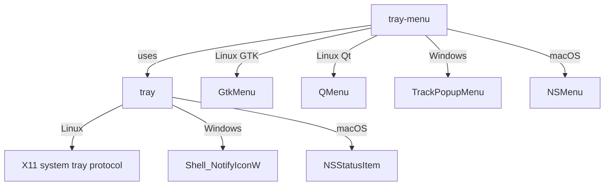

# tray

Cross-platform system tray for Rust.

| Crate | crates.io |
|-------|-----------|
| [`tray`](crates/tray) | [](https://crates.io/crates/tray) |
| [`tray-menu`](crates/tray-menu) | [](https://crates.io/crates/tray-menu) |

## Install

```bash
cargo add tray-menu --features gtk   # Linux (includes tray)
cargo add tray-menu                   # Windows/macOS (includes tray)
cargo add tray                        # Just the icon, no menus
```

## Usage

```rust
use tray_menu::{
    CheckEntry, Divider, Icon, MouseButton, MouseButtonState,
    PopupMenu, SubMenu, TextEntry, TrayIconBuilder, TrayIconEvent,
};

fn main() {
    let icon = Icon::from_rgba(vec![0u8; 32 * 32 * 4], 32, 32).unwrap();

    let _tray = TrayIconBuilder::new()
        .with_icon(icon)
        .with_tooltip("My App")
        .build()
        .unwrap();

    loop {
        if let Ok(TrayIconEvent::Click {
            button: MouseButton::Right,
            button_state: MouseButtonState::Up,
            position,
            ..
        }) = TrayIconEvent::receiver().try_recv()
        {
            let mut menu = PopupMenu::new();
            menu.add(&TextEntry::of("open", "Open"));
            menu.add(&CheckEntry::of("notify", "Notifications", true));
            menu.add(&Divider);

            let mut help = SubMenu::of("Help");
            help.add(&TextEntry::of("about", "About"));
            menu.add(&help);

            menu.add(&Divider);
            menu.add(&TextEntry::of("quit", "Quit"));

            if let Some(id) = menu.popup(position) {
                if id.0 == "quit" {
                    break;
                }
            }
        }
        std::thread::sleep(std::time::Duration::from_millis(16));
    }
}
```

## Examples

```bash
cargo run -p tray-menu --features gtk --example simple-menu            # right-click menu
cargo run -p tray-menu --features gtk --example simple-menu -- left    # left-click menu
cargo run -p tray-menu --features gtk --example simple-menu -- enter   # hover to open
cargo run -p tray --example simple-tray                                # icon only, no menu
```

See the [`justfile`](justfile) for more commands.

## Platform Support

| Platform | Tray Icon | Popup Menu |
|----------|-----------|------------|
| Linux | X11 system tray | GTK or Qt |
| Windows | Shell_NotifyIconW | TrackPopupMenu |
| macOS | NSStatusItem | NSMenu |

## Architecture



**`tray`** - Thread-safe tray icon with mouse events (click, double-click, hover). No menus.

**`tray-menu`** - Popup menus with text items, checkboxes, submenus, dividers. Re-exports `tray`.

## License

MIT
